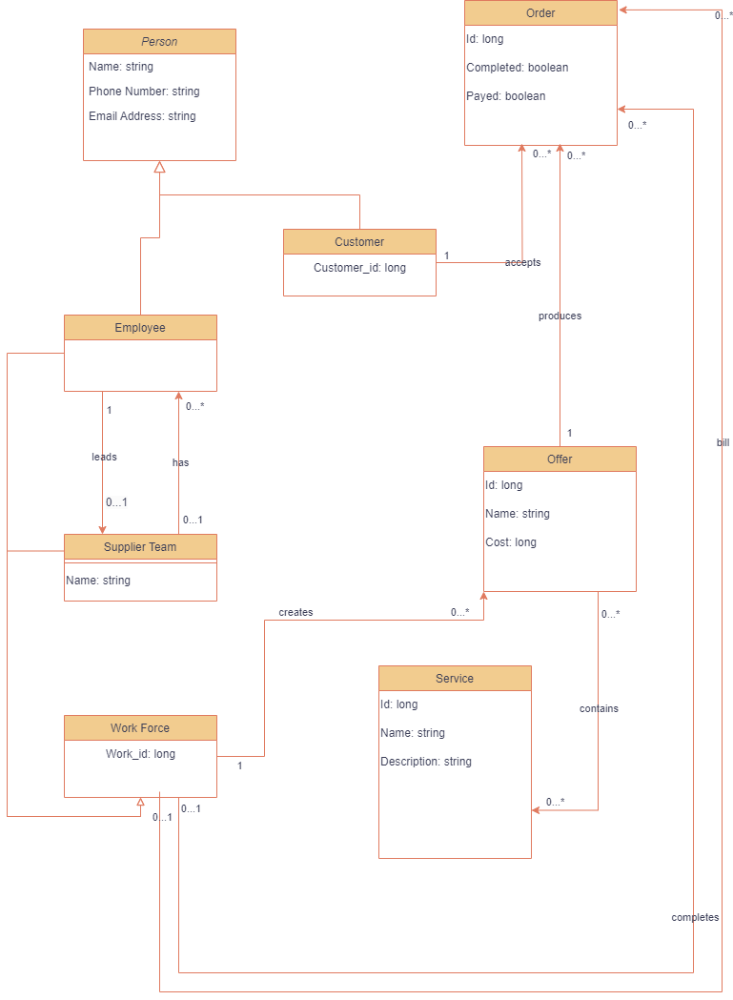

### Repository for completing education tasks

#### Progress

- **Static array** (_completed_)

- **Object array** (_issues from mt fixed_)
    - PFArray methods done
    - Tests written
    - Interaction with user implemented

- **Files** (_waiting for review_)
    - Game reading methods done
    - File writing methods done
    - Method testing done

- **Spring I**
    - Business task:
        - Samotný systém umožňuje uživateli zadat nabídku na dodávku IT služeb. Nabídku vždy realizuje konkrétní
          pracovník nebo skupina pracovníků dodavatele. Před začátkem práce je nutné, aby zákazník akceptoval nabídku
          jako takovou, až poté je možné zahájit na ní práci. Po dodání musí též zákazník provést akceptaci dodání, až
          potom ji může dodavatel odfakturovat.
    - Created data diagram (_needs review!_ - i really am not sure what im doing)
    - 
    - Started with REST API definition in OpenAPI